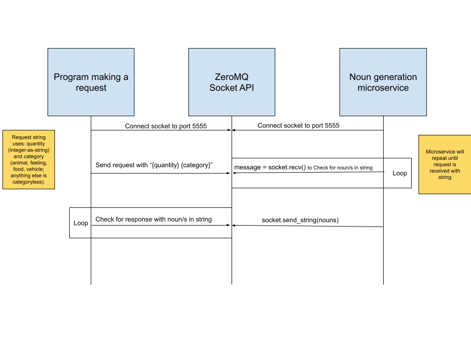

Local microservice that a client can request nouns from using ZeroMQ implemented in python. These nouns can be specified (animal, food, transportation, etc...) or will be randomized.

Once sockets are bound/connected on port 5555, you can request and recieve data from the noun-generation microservice.

To REQUEST data, send a string message:
 
`socket.send_string(f"{quantity} {category}")`
 
Where quantity is any integer represented as a string, and category is a string using one of the following categories: animal, feeling, food, vehicle. Any other text entered will generate a categoryless noun.
 

To RECIEVE data:
 
`nouns = socket.recv()`
 
You will recieve a string with your requested quantity of nouns, each with a space between them.

An example client is included to show how to connect and call the microservice.

